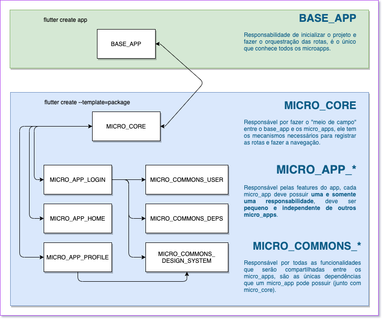

# Definições e Padrões do Projeto



Esta documentação encontra-se alguns acordos firmados pelos times de Desenvolvimento envolvidos com a tecnologia Flutter e como sera trabalhado.

---
## Versionamento

Lembre-se de no pubspec.yaml sempre atualizar a versão, a tag dev seguir a mesma.
```yaml
version: 1.0.1
```
Deve-se também a cada alteração ser relatado no arquivo CHANGELOG.md as esterações realizadas, versão, data e se disponível a branch.
```md
## [1.0.1] - Fix Dependencies - 21/04/2021 - [fix/fix-dependencies]
* Foi atualizado as dependencias no no arquivo pubspec.yaml
```
A Forma de versionamento definida foi utilizando Tags.
```bash
Listagem de Tags: git tag -n
Criação de Tags: git tag 'v<mejor.minor.patch>'
Enviar as Tags: git push --tags
```
A importação das versões criadas deve ser da seguinte forma:
```yaml
dependencies:
  micro_core:
    git:
      url: https://github.com/DeividWillyan/-Curso-Micro-Core.git
      ref: v1.0.0 # <- Aqui vai a Tag versionada
```
| obs: Também pode ser utilizado o dependency_overrides para resolver conflito de versões.


Links úteis

- [How to Create Git Tag](https://devconnected.com/how-to-create-git-tags)
- [Semantic Versioning 2.0.0](https://semver.org/)

---
## Arquitetura

descrição da forma da arquitetura

Links úteis

- [Lab: Write your first Flutter app](https://flutter.dev/docs/get-started/codelab)
- [Cookbook: Useful Flutter samples](https://flutter.dev/docs/cookbook)
---
## Testes

Utilizaremos 4 formas de testes, Unit, Widget, Integration/Driver e Golden Test.

### Unit Test
Utilizaremos os testes de unidades para validar tudo que é regra de negocio (códigos puramente dart).

```dart
test('Should LoginController return true in login method with correct values', () async {
    bool result = await _controller.login(user, pass);
    expect(result, true);
});
```
### Widget Test
Utilizaremos os testes de Widget para validar se nossas Pages estão renderizando conforme o esperado.

```dart
testWidgets("Should find a single widget per view on screen rendering", (WidgetTester tester) async {
    await tester.pumpWidget(MaterialApp(home: LoginPage()));

    final appBarTitle = find.text('Login');
    expect(appBarTitle, findsOneWidget);
});
```
### Golden Test
Utilizaremos os testes de Golden para validar se os componentes em nosso Design System estão sendo criados conforme o esperado, tendo um feedback visual rapido e eficiente.

```dart
// flutter_test_config.dart
import 'dart:async';

import 'package:golden_toolkit/golden_toolkit.dart';

Future<void> testExecutable(FutureOr<void> Function() testMain) async {
  return GoldenToolkit.runWithConfiguration(
    () async {
      await loadAppFonts();
      await testMain();
    },
    config: GoldenToolkitConfiguration(),
  );
}

// custom_button_widget_test.dart
testGoldens("CustomButtonWidget - Multiples Scenarios", (tester) async {
    final builder = GoldenBuilder.grid(columns: 2, widthToHeightRatio: 1)
      ..addScenario(
        'Default',
        CustomButtonWidget(
          text: 'CustomButton',
          onPressed: () {},
        ),
      )
      ..addScenario(
        'Outlier',
        CustomButtonWidget(
          text: 'CustomButton',
          onPressed: () {},
          outline: true,
        ),
      )

    await tester.pumpWidgetBuilder(
      builder.build(),
      surfaceSize: const Size(500, 300),
    );
    await screenMatchesGolden(tester, 'custonButton_multiples_states');
  });

// RUN
flutter test --update-goldens
```
### Integration/Driver Test
Utilizaremos os testes de integração para garantir um completo funcionamento end-to-end.
```dart
// test_driver/integration_test.dart
import 'package:integration_test/integration_test_driver.dart';

Future<void> main() => integrationDriver();

// integration_test/complete_app_test.dart
void main() {
  IntegrationTestWidgetsFlutterBinding.ensureInitialized();
  testWidgets('Complete App Navigation Flux', (WidgetTester tester) async {
    await tester.pumpWidget(MyApp());

    final btnGoToHomePage = find.text('goToHome');
    expect(btnGoToHomePage, findsOneWidget);

    await tester.tap(btnGoToHomePage);
    await tester.pumpAndSettle();

    final pageHomeTitle = find.text('Home');
    expect(pageHomeTitle, findsOneWidget);

    await tester.pageBack();
    await tester.pumpAndSettle();

    final pageLoginTitle = find.text('Login');
    expect(pageLoginTitle, findsOneWidget);
  });
}

// Run
flutter drive --driver=test_driver/integration_test.dart --target=integration_test/complete_app_test.dart

```
Links úteis

- [Flutter Test](https://flutter.dev/docs/testing)
- [Integration Test](https://flutter.dev/docs/cookbook/testing/integration/introduction)
- [Golden Test](https://pub.dev/packages/golden_toolkit)
---
## Code Review
desrição da forma de versionamento

Links úteis

- [Lab: Write your first Flutter app](https://flutter.dev/docs/get-started/codelab)
- [Cookbook: Useful Flutter samples](https://flutter.dev/docs/cookbook)
---
## Scripts 
desrição da forma de versionamento

Links úteis

- [Lab: Write your first Flutter app](https://flutter.dev/docs/get-started/codelab)
- [Cookbook: Useful Flutter samples](https://flutter.dev/docs/cookbook)

---
### Outros
desrição da forma de versionamento

Links úteis

- [Lab: Write your first Flutter app](https://flutter.dev/docs/get-started/codelab)
- [Cookbook: Useful Flutter samples](https://flutter.dev/docs/cookbook)
